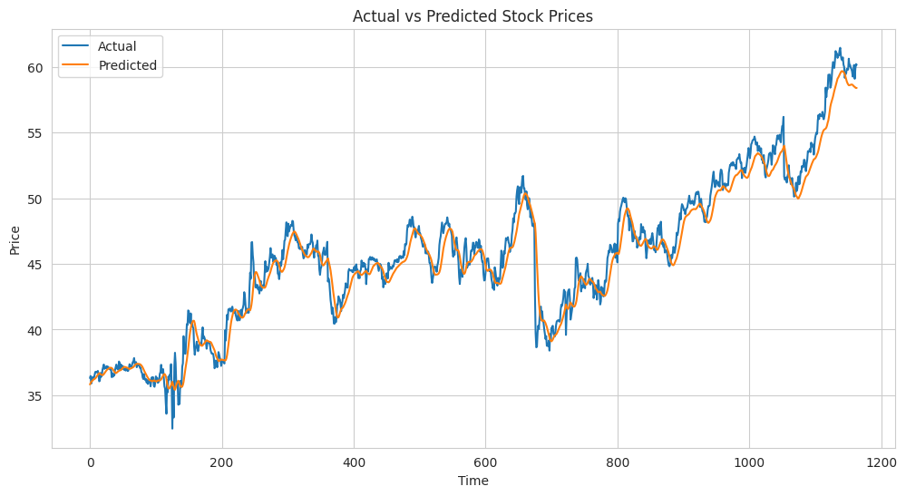

# Stock Price Prediction using LSTM

This project demonstrates the prediction of stock prices using a Long Short-Term Memory (LSTM) neural network. The model is trained on historical stock price data from Walmart (WMT) and utilizes features like adjusted close prices and trading volume to predict future prices.

## Project Overview

The notebook uses a combination of data preprocessing, scaling, and deep learning techniques to predict stock prices. It leverages the following:

- **Pandas & NumPy**: For data manipulation and preprocessing.
- **TensorFlow (Keras)**: To build and train the LSTM neural network.
- **Matplotlib & Seaborn**: For visualizing the predictions versus actual stock prices.

### Workflow

1. **Data Preprocessing**:

   - Loaded the Walmart stock data from a CSV file.
   - Converted the `Date` column to datetime format and set it as the index.
   - Converted price and volume columns to appropriate data types.
   - Created a 20-day moving average for exploratory data analysis (optional, removed later).
   - Scaled the data using `MinMaxScaler` for normalization.

2. **LSTM Model**:

   - Created sequences of past 300 days (`sequence_length = 300`) of `Adj Close` and `Volume` data as input features.
   - Split the data into training and testing sets.
   - Defined an LSTM model with two layers of LSTM units, dropout layers for regularization, and dense layers for final output.

3. **Training**:

   - Trained the model using the Adam optimizer with a learning rate of 0.0001.
   - Utilized early stopping with patience to prevent overfitting.

4. **Evaluation**:
   - Evaluated the model on the test set using Mean Squared Error (MSE).
   - Computed metrics like Root Mean Squared Error (RMSE) and R-squared.
   - Visualized the actual versus predicted stock prices.

## Results

- **Test Loss**: The loss on the test set as evaluated by the Mean Squared Error.
- **RMSE**: The root mean squared error between the actual and predicted stock prices.
- **R-squared**: The R-squared metric indicating the goodness of fit.
- **Maximum Error**: The maximum absolute difference between actual and predicted values.

## Visualization

The notebook generates a plot comparing the actual stock prices with the predicted values:

- **Blue Line**: Represents the actual stock prices.
- **Orange Line**: Represents the predicted stock prices.



## Dependencies

- Python 3.x
- Pandas
- NumPy
- TensorFlow (Keras)
- Scikit-learn
- Matplotlib
- Seaborn

You can install the required packages using the following command:

```bash
pip install -r requirements.txt
```
